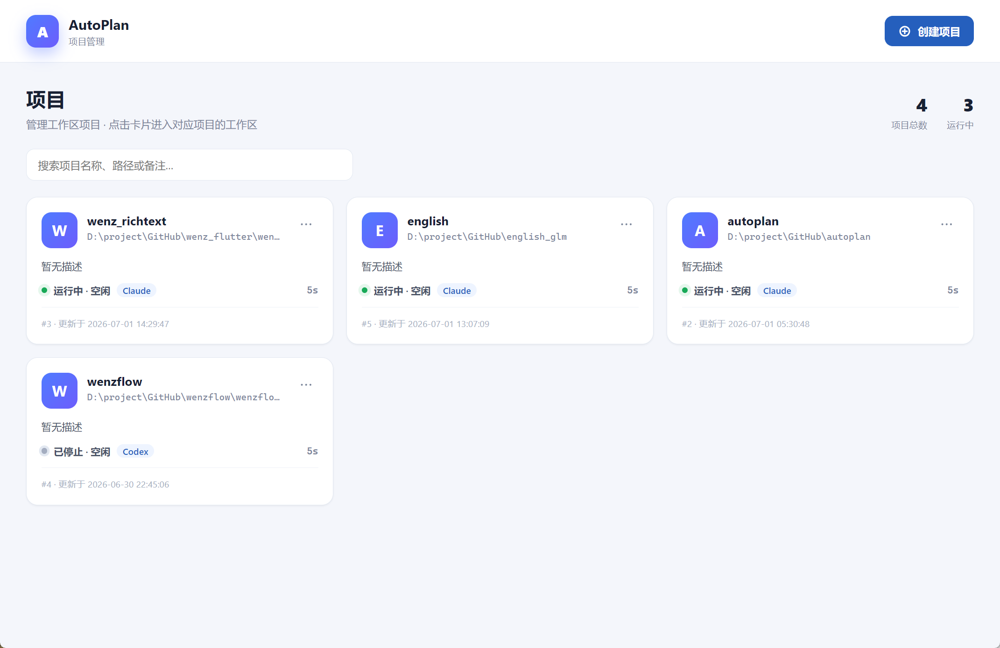

# AutoPlan

## 简介

一款支持24小时执行编程任务的开源工具，支持项目管理、需求管理、反馈管理、计划任务队列。

所有计划与任务都可以回溯，每次计划与任务都在增加项目的长期记忆。

## 为什么有这个项目？

claude,codex,zcode之类的工具喜欢问问题，事实上讨论需求才需要问问题，需求明确还问个毛线，一个脚本搞定编程任务就行了。

[一个脚本搞定全自动编程](https://www.bilibili.com/video/BV142jX6zEyd)

随着AI越来越智能，编程任务其实就可以像人工智能驾驶一样，逐渐卸载方向盘了。

人工智能驾驶，需要给它目的地和路况，那么AutoPlan也一样，只需要给它需求和反馈。

也就是说，项目开发只需要需求与反馈的循环，就可以让项目无限趋近100%完成任务。

这个可以验证，[ai哲学，解决99%编程问题](https://www.bilibili.com/video/BV1TsEC6DEik)。

随着需求和反馈的循环，项目会越来越完善，你的钱包也会越来越完善。

## 快速开始

1.安装codex/claude/opencode

2.安装autoplan

3.创建项目

4.启动循环(工作界面，右上角启动)

5.提需求(可以通过第三方工具讨论需求，然后mcp发送给autoplan执行)

6.提反馈

7.验收(对完成的任务进行人工验收即可)

## 使用教程

[AutoPlan使用教程](https://www.bilibili.com/video/BV1KLTY6oEHe)

[如何让AI 24小时工作？](https://www.bilibili.com/video/BV1ExTK6NEPW)

[AI计划草稿，开发前先对齐需求~](https://www.bilibili.com/video/BV16jTP6YE45)

## 功能列表

- [x] 项目管理
- [x] 工作循环
- [ ] 对话
- [x] 需求
- [x] 反馈
- [x] 计划与任务
- [x] 脚本
- [x] 事件流
- [ ] 终端
- [ ] 执行器

## 相关案例

[AutoPlan重构笔记编辑器](https://www.bilibili.com/video/BV1VcTH6qEKw)

案例征集中：请直接联系下方[联系方式](#联系方式)，或者直接提issue~

## 桌面端截图

### 项目管理

### 工作界面

## Star History

<a href="https://www.star-history.com/?repos=lyming99%2Fautoplan&type=date&legend=top-left">
 <picture>
   <source media="(prefers-color-scheme: dark)" srcset="https://api.star-history.com/chart?repos=lyming99/autoplan&type=date&theme=dark&legend=top-left" />
   <source media="(prefers-color-scheme: light)" srcset="https://api.star-history.com/chart?repos=lyming99/autoplan&type=date&legend=top-left" />
   
 </picture>
</a>

## 联系方式

遇到问题？欢迎联系微信：lyming555，Email: 44185539@qq.com
